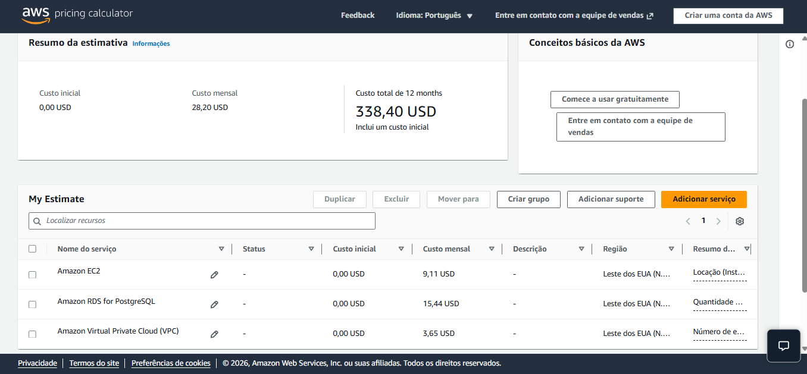

# Relatório de Entrega — Tech Challenge Fase 1 (ToggleMaster)

**Curso**: Pós-Tech DevOps e Arquitetura Cloud  
**Fase**: Fase 1 — Cultura DevOps, Cloud e Arquiteturas  
**Integrantes do Grupo**:
- **Mayara Finatto** — RM375879
- **Walter Ribeiro** — RM375778

---

## 🔗 Links e Documentação da Entrega

- **Vídeo de Demonstração**: [`Youtube`](https://youtu.be/2sGbq-hscMY) | [`Google Drive`](https://docs.google.com/videos/d/1A5Eip8zQSsJWqqrSavVVVBJ5OVGJylzvEQ8oahBSvUU/play?usp=sharing)
- **Diagrama de Arquitetura AWS**: [`aws-architecture-diagram.drawio`](./aws-architecture-diagram.drawio)
- **Repositório Git**: [`toggle-master-monolith`](https://github.com/walteribeiro/toggle-master-monolith)

---

## 1. Análise Arquitetural: Aplicação Monolítica

O **ToggleMaster** é uma plataforma de *Feature Flag as a Service*. Em sua primeira fase (MVP), ele foi construído seguindo uma **arquitetura monolítica**.

### 1.1. Características Monolíticas Identificadas no Código
- **Unidade Única de Código**: O arquivo [`app.py`](./app.py) concentra todas as responsabilidades — roteamento HTTP, validações, regras de negócio, queries SQL (`psycopg2`) e inicialização do schema do banco (`init-db`).
- **Artefato Único de Deploy**: Todo o sistema é empacotado em uma única imagem Docker ([`Dockerfile`](./Dockerfile)) e executado como um único processo Gunicorn.
- **Base de Dados Compartilhada**: Todos os endpoints interagem com a mesma base PostgreSQL e com a tabela `flags`.
- **Escalabilidade em Bloco**: Para aumentar a capacidade de leitura de flags, é necessário replicar o processo completo da aplicação.

### 1.2. Vantagens e Desvantagens no Cenário Atual

| Dimensão | Vantagens no MVP | Desvantagens no Crescimento |
|---|---|---|
| **Desenvolvimento** | Alta velocidade inicial, curva de aprendizado baixa e facilidade para refatorar. | Risco de acoplamento excessivo e acúmulo de débito técnico conforme novas regras surgirem. |
| **Operação e Deploy** | Deploy simples (`docker compose up` local ou contêiner na EC2). | Raio de explosão total: qualquer bug em um endpoint pode derrubar a aplicação inteira. |
| **Infraestrutura** | Menor custo operacional e sem overhead de comunicação via rede entre serviços. | Impossibilidade de escalar de forma granular os recursos apenas para os endpoints de maior tráfego (`GET /flags/<nome>`). |

---

## 2. Análise Prática dos 12 Fatores (12-Factor App)

Análise crítica do alinhamento da aplicação com as boas práticas do 12-Factor App:

### I. Base de Código (Codebase)
- **Status**: ✅ **Atende totalmente**
- **Análise Técnica**: Existe um único repositório Git rastreado por controle de versão. A partir desta base única, são realizados múltiplos deploys em diferentes ambientes (desenvolvimento local com Docker Compose e produção na AWS EC2).

### II. Dependências (Dependencies)
- **Status**: ✅ **Atende totalmente**
- **Análise Técnica**: O isolamento de runtime é garantido pela imagem Docker (`python:3.9-slim`), e as bibliotecas Python são declaradas via [`requirements.txt`](./requirements.txt). Além disso, o arquivo fixa versões exatas para todas as dependências (`Flask==2.2.2`, `Werkzeug==2.3.8`, `psycopg2-binary==2.9.5` e `gunicorn==20.1.0`), reduzindo divergências entre builds.

### III. Configurações (Config)
- **Status**: ✅ **Atende totalmente**
- **Análise Técnica**: O código em [`app.py`](./app.py) lê estritamente todas as configurações por variáveis de ambiente (`DB_HOST`, `DB_NAME`, `DB_USER`, `DB_PASSWORD`, `DB_PORT`) usando `os.getenv()`. Elas são injetadas externamente (via `docker-compose.yaml` em dev ou `export` na EC2). Nenhuma credencial está contida no código-fonte.
- **Esclarecimento sobre o "arquivo/doc separado para variáveis" (`.env`)**:
  - A intuição do time em ter um arquivo separado (como `.env`) faz todo sentido para organização local do projeto. 
  - Para o 12-Factor, a regra estrita é que **o código não dependa de arquivos de configuração com credenciais dentro do repositório**. As variáveis devem vir do sistema operacional/ambiente de execução.
  - **Boa Prática recomendada**: Criar um arquivo `.env.example` (versionado no Git) apenas listando os nomes das variáveis necessárias, e manter o arquivo `.env` real (com as credenciais de dev/prod) fora do Git (no `.gitignore`).

### IV. Serviços de Apoio (Backing Services)
- **Status**: ✅ **Atende totalmente**
- **Clarificação**: No 12-Factor, *Serviços de Apoio* referem-se a recursos anexados à rede (como bancos de dados e caches). O PostgreSQL é tratado como um recurso anexo conectado via rede (`DB_HOST`). Trocar o banco local do Docker Compose para o Amazon RDS gerenciado não exige nenhuma alteração no código da aplicação.

### V. Build, Release, Run
- **Status**: 🟡 **Atende parcialmente**
- **Análise Técnica**: As três etapas são conceitualmente separadas:
  - **Build**: Construção da imagem Docker com a instalação das dependências.
  - **Release**: Combinação da imagem compilada com as variáveis de ambiente do destino.
  - **Run**: Execução do contêiner rodando [`entrypoint.sh`](./entrypoint.sh) e Gunicorn.
- **Ponto de Melhoria**: Atualmente a execução é manual; recomenda-se automatizar o ciclo Build/Release/Run utilizando um pipeline de CI/CD (ex.: GitHub Actions).

### VI. Processos (Processes)
- **Status**: ✅ **Atende totalmente**
- **Análise Técnica**: A aplicação é *stateless* (sem estado). O processo da API não armazena dados em memória nem no sistema de arquivos local entre requisições; todo o estado persistente reside no banco PostgreSQL.

### VII. Vinculação de Portas (Port Binding)
- **Status**: ✅ **Atende totalmente**
- **Análise Técnica**: O ToggleMaster é totalmente autônomo (self-contained) e exporta seus serviços via port binding na porta `5000` via Gunicorn (`EXPOSE 5000`), sem depender de um servidor de aplicação web externo injetado.

### VIII. Concorrência (Concurrency)
- **Status**: 🟡 **Atende parcialmente**
- **Análise Técnica**: O servidor Gunicorn já oferece concorrência no nível de processo (através de múltiplos *workers*). No entanto, para escalabilidade horizontal da infraestrutura, é necessário adicionar um Load Balancer (AWS ALB) e um Auto Scaling Group para distribuir tráfego entre múltiplas instâncias EC2.

### IX. Descartabilidade (Disposability)
- **Status**: ✅ **Atende totalmente**
- **Análise Técnica**: Os processos sobem rapidamente e encerram graciosamente. O script [`entrypoint.sh`](./entrypoint.sh) utiliza `pg_isready` para aguardar a prontidão do banco antes de iniciar o servidor, garantindo resiliência na inicialização.

### X. Paridade entre Desenvolvimento e Produção (Dev/Prod Parity)
- **Status**: 🟡 **Atende parcialmente**
- **Análise Técnica**: Há paridade no motor de banco (PostgreSQL em dev e prod). Contudo, a execução local roda via Docker Compose, enquanto em produção na AWS o deploy inicial roda diretamente na EC2.
- **Ponto de Melhoria**: Adotar Infraestrutura como Código (Terraform) para criar ambientes de Staging e Produção idênticos e padronizar o deploy de contêineres na nuvem (ex.: AWS ECS).

### XI. Logs
- **Status**: 🟡 **Atende parcialmente**
- **Clarificação**: No 12-Factor, a aplicação **nunca** deve gerenciar ou armazenar seus próprios arquivos de log. As mensagens de inicialização e os logs do Gunicorn são direcionados para a saída padrão (`stdout`/`stderr`), e cabe à infraestrutura (AWS CloudWatch Logs ou Docker Logging Driver) capturar e armazenar esse fluxo. Entretanto, o `app.py` ainda não utiliza explicitamente o módulo `logging` para registrar falhas e eventos relevantes das requisições; em vários casos, os erros são apenas capturados e retornados na resposta HTTP.

### XII. Processos Administrativos (Admin Processes)
- **Status**: 🟡 **Atende parcialmente**
- **Análise Técnica**: A aplicação disponibiliza o comando administrativo `flask init-db`, executado no mesmo ambiente e imagem do código através do [`entrypoint.sh`](./entrypoint.sh). Entretanto, atualmente esse comando é acoplado à inicialização do contêiner e executado a cada startup, em vez de ser tratado como uma tarefa administrativa independente. Para melhorar a aderência ao 12-Factor, recomenda-se utilizar uma ferramenta de migração, como Alembic ou Flask-Migrate, e executar as migrações como um processo administrativo separado, com falhas retornando código de erro.

---

## 3. Decisões de Arquitetura e Desafios Encontrados

### 3.1. Decisões Arquiteturais Tomadas
1. **Endereçamento de Rede e Máscaras (Bloco CIDR /24)**:
   - Optou-se pelo bloco de IP `/24` na VPC.
   - **Topologia de Subredes**:
     - **Uma Subrede Pública**: Onde foi provisionada a instância EC2 com IP Público. Como o sistema nesta Fase 1 é um MVP e não-crítico, não foi exigida alta disponibilidade (multi-AZ) para a camada de aplicação.
     - **Duas Subredes Privadas (Multi-AZ)**: Criadas em zonas de disponibilidade distintas para atender ao pré-requisito técnico do **Amazon RDS**, que exige um *DB Subnet Group* abrangendo pelo menos duas Availability Zones (AZs) para isolamento e resiliência do banco de dados.

2. **Segurança e Isolamento por Security Groups**:
   - **`sg-togglemaster-ec2`**: Permite tráfego HTTP na porta `5000` (`0.0.0.0/0`) e SSH na porta `22`.
   - **`sg-togglemaster-rds`**: Permite tráfego PostgreSQL na porta `5432` **exclusivamente vindo do `sg-togglemaster-ec2`**, impedindo qualquer acesso direto ao banco vindo da internet.

### 3.2. Desafios Encontrados durante o Projeto
1. **Primeiro Contato e Compreensão dos 12 Fatores**:
   - Este foi o primeiro contato da equipe com a metodologia *12-Factor App*. O maior desafio foi correlacionar os conceitos teóricos (como *Backing Services* e *Logs*) com a realidade do código em Python/Flask e entender onde termina a responsabilidade da aplicação e onde começa a da infraestrutura.
2. **Gerenciamento Manual de Variáveis de Ambiente no Terminal**:
   - Durante a execução do servidor Gunicorn na EC2, o carregamento das variáveis via `export` precisava ser feito manualmente a cada nova sessão de terminal SSH. Como melhoria futura, o gerenciamento de serviços será automatizado via `systemd` ou Docker em produção.

---

## 4. Arquitetura na Nuvem e Estimativa de Custos (AWS)

Abaixo está a projeção detalhada de custos para a infraestrutura provisionada na AWS (Região `us-east-1`):

Também disponível em: https://calculator.aws/#/estimate?id=ee39fa3e25cfcab2f7f02eb89df31e97d9d46505
